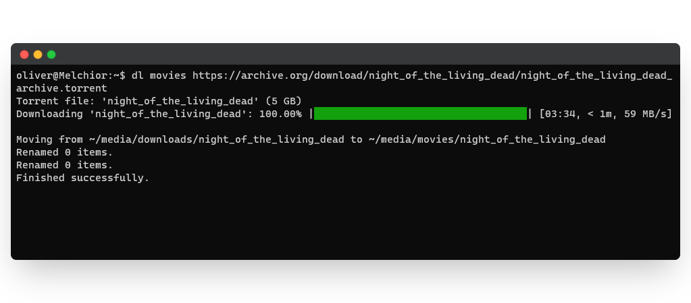

# jellyfin-torrent-downloader

Small script used for my personal Netflix-like media server to automatically download movies and tv shows 
and add them to its library. 

For ease of use it's recommended to save the path to the executable in an alias.
Note the program has to run with root privileges to avoid conflicts with file permissions.   

`alias dl="sudo -E python3 ~/jellyfin-torrent-downloader/main.py"`
